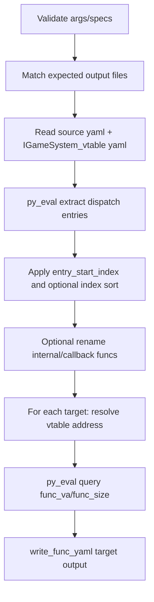

# _igamesystem_dispatch_common

## Overview
`ida_preprocessor_scripts/_igamesystem_dispatch_common.py` provides shared async preprocessing logic for dispatch-style IGameSystem skills. It resolves target IGameSystem virtual functions from a source dispatch function (with platform-specific IDA pattern extraction), optionally renames helper/callback functions, and writes per-target YAML function metadata.

## Responsibilities
- Validate and normalize `target_specs`, `entry_start_index`, and `multi_order`.
- Load required YAML inputs: source function YAML and `IGameSystem_vtable.{platform}.yaml`.
- Build platform-specific `py_eval` code (`windows`/`linux`) to extract dispatch entries (`vfunc_offset`, `vfunc_index`, optional `game_event_addr`, optional `internal_addr`).
- Map extracted entries to `target_specs`, query function info from vtable-resolved addresses, and write normalized function YAML payloads.
- Perform best-effort IDA renaming via MCP `rename` for internal wrapper and callback functions when configured.

## Files Involved (no line numbers)
- ida_preprocessor_scripts/_igamesystem_dispatch_common.py
- ida_analyze_util.py
- ida_preprocessor_scripts/find-IGameSystem_*.py
- `<new_binary_dir>/{source_yaml_stem}.{platform}.yaml`
- `<new_binary_dir>/IGameSystem_vtable.{platform}.yaml`
- `<new_binary_dir>/{target_name}.{platform}.yaml`

## Architecture
`preprocess_igamesystem_dispatch_skill(...)` is the public entry and orchestrates helper functions:

- `_read_yaml`: safe YAML reader with failure-to-None behavior.
- `_parse_int`: tolerant integer parser (supports decimal/hex-like strings).
- `_build_dispatch_py_eval`: generates inline IDA Python for dispatch extraction.
- `_call_py_eval_json`: executes `py_eval` and parses JSON payload.
- `_query_func_info`: validates function boundary (`start_ea == addr`) and returns `func_va/func_size`.
- `_rename_func_best_effort`: non-fatal wrapper around MCP `rename`.

Platform extraction heuristics in `_build_dispatch_py_eval`:
- Windows path: scans `lea rdx, <callback>` then inspects callback `call/jmp [reg+disp]`.
- Linux path: scans `mov esi/rsi, odd_imm` plus next `call`, then computes `vfunc_offset = imm - 1`.

## Dependencies
- Standard library: `json`, `os`.
- Optional package: `PyYAML` (`yaml`); preprocessing returns `False` early when unavailable.
- Internal utilities: `parse_mcp_result`, `write_func_yaml` from `ida_analyze_util`.
- IDA MCP tools used through session:
  - `py_eval` (entry extraction and function-info query)
  - `rename` (best-effort symbol naming)

## Notes
- Fail-fast behavior: most validation/extraction mismatches return `False` for upstream fallback.
- `expected_outputs` must contain exactly one basename match per target (`{target_name}.{platform}.yaml`).
- `vfunc_index`/`vfunc_offset` logic assumes 64-bit vtable slots (`index * 8` and `offset // 8`).
- Renaming is intentionally non-fatal; failures only print when `debug=True`.
- Windows/Linux extraction relies on compiler-pattern heuristics and can break when codegen changes.

## Callers (optional)
- Imported and called by multiple dispatch finder scripts in `ida_preprocessor_scripts/find-IGameSystem_*.py`.
- Confirmed direct callers include:
  - `ida_preprocessor_scripts/find-IGameSystem_ClientAdvanceTick.py`
  - `ida_preprocessor_scripts/find-IGameSystem_ClientPreRender-AND-IGameSystem_ClientPreRenderEx.py`
  - `ida_preprocessor_scripts/find-IGameSystem_PreSpawnGroupLoad.py`
  - `ida_preprocessor_scripts/find-IGameSystem_PostSpawnGroupLoad.py`
  - plus other `find-IGameSystem_*` wrappers that delegate their `preprocess_skill` to this common routine.