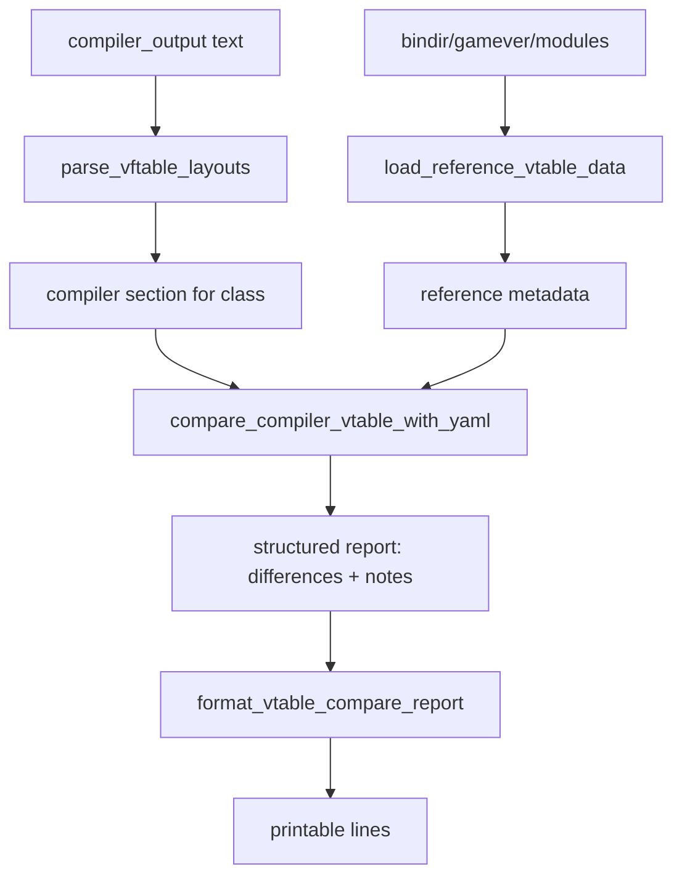

# cpp_tests_util

## Overview
`cpp_tests_util.py` provides reusable helpers for parsing clang vtable dumps and comparing them against YAML-based reference metadata. It is the core comparison engine used by the C++ test runner.

## Responsibilities
- Map target triples to YAML platform names (`windows` / `linux`).
- Parse `-fdump-vtable-layouts` compiler output into structured per-class entries.
- Load reference vtable metadata from module-prioritized YAML files.
- Compare compiler-derived vtable structure against YAML expectations.
- Produce human-readable report lines from structured comparison output.

## Involved Files (no line numbers)
- cpp_tests_util.py
- run_cpp_tests.py
- config.yaml
- bin/<gamever>/<module>/<ClassName>_*.{platform}.yaml

## Architecture
High-level flow:

Key function interactions:
- `compare_compiler_vtable_with_yaml` orchestrates parsing + reference loading + diff generation.
- `parse_vftable_layouts` relies on `VFTABLE_HEADER_RE` / `VFTABLE_ENTRY_RE` and `_extract_member_name`.
- `load_reference_vtable_data` uses `_parse_int_maybe` and `_normalize_reference_member_name`.
- `format_vtable_compare_report` renders report dicts for CLI output.

## Dependencies
- Python stdlib: `re`, `pathlib.Path`, `typing`.
- Third-party: `PyYAML` (import is optional at module load; required at runtime for YAML loading).
- Input contracts:
  - clang output produced with `-fdump-vtable-layouts`.
  - YAML fields such as `vtable_size`, `vtable_numvfunc`, `vfunc_index`, `func_name`.

## Notes
- `map_target_triple_to_platform` currently maps:
  - `x86_64-pc-windows-msvc` -> `windows`
  - `x86_64-pc-windows-gnu` -> `linux`
  - `x86_64-*-linux-gnu` -> `linux`
  Unmatched triples return `None`.
- `pointer_size_from_target_triple` currently always returns `8` (even fallback path), so non-64-bit targets are not differentiated.
- `parse_vftable_layouts` guards against over-consuming unrelated clang blocks by stopping when parsed index reaches declared entry bounds.
- `load_reference_vtable_data` respects module priority order and returns the first module that yields vtable metadata; within a module, later files can overwrite the same `vfunc_index` entry.
- Name mismatch checks require both expected and actual member names to be non-empty; missing name tokens do not produce `vfunc_name_mismatch`.
- Comparison currently checks reference-defined indices only; extra compiler indices beyond reference are not flagged as dedicated differences.

## Callers (optional)
- `run_cpp_tests.py` imports and uses:
  - `map_target_triple_to_platform`
  - `pointer_size_from_target_triple`
  - `compare_compiler_vtable_with_yaml`
  - `format_vtable_compare_report`
