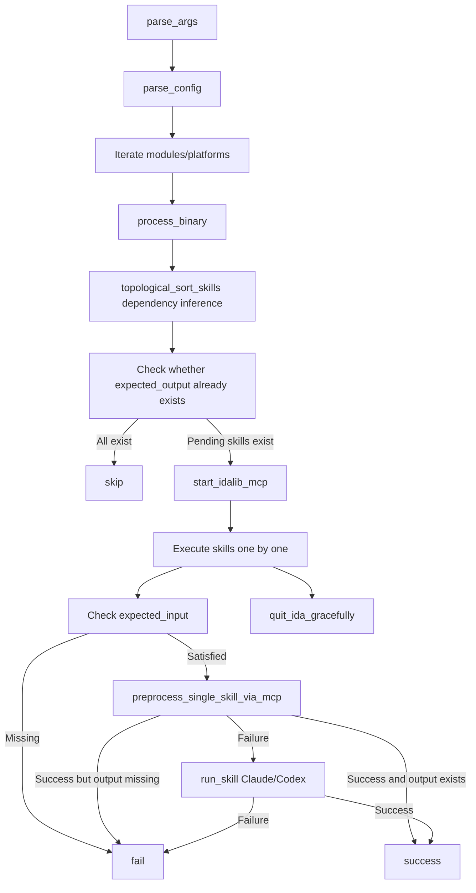

# ida_analyze_bin

## Overview
`ida_analyze_bin.py` is the main orchestration entry point for CS2 binary signature analysis: after loading `config.yaml`, it executes by module/platform/skill order, prioritizes preprocessing, and only falls back to Claude/Codex skills to complete YAML outputs when preprocessing fails; postprocess secondary validation is no longer executed.

## Responsibilities
- Parse CLI arguments and build runtime context (platform filter, module filter, `oldgamever` inference, default retry count, etc.).
- Parse `config.yaml` `modules[*].skills[*]` metadata and extract `expected_input/expected_output/max_retries` (`prerequisite` is only kept as a compatibility fallback).
- For each binary, perform topological sorting and skip checks for skills based on input/output dependencies (skip directly if outputs already exist).
- Start and manage the `idalib-mcp` lifecycle (startup wait, task execution, graceful shutdown/forced cleanup).
- Execute the single-phase output flow of "preprocess -> fallback to Agent on failure", and count success/failure/skipped.
- Aggregate success/failure/skipped statistics and exit with a non-zero code if any failure exists.

## Files Involved (no line numbers)
- ida_analyze_bin.py
- config.yaml
- ida_skill_preprocessor.py
- ida_analyze_util.py
- .claude/agents/sig-finder.md
- .claude/skills/<skill>/SKILL.md

## Architecture
The main entry works in layered flow `main -> process_binary -> (preprocess/run_skill)`:

Key implementation points:
- `topological_sort_skills` builds an index by `expected_output -> producer`, then reverse-maps each skill's `expected_input` to producers to infer dependencies.
- Dependency matching first uses normalized full path (`normpath + normcase`), and falls back to filename matching (basename) if full-path match fails.
- `prerequisite` is still read and merged into the dependency graph as a legacy compatibility/supplement mechanism.
- Sorting uses Kahn's algorithm, with same-layer node sorting to guarantee stable execution order.
- `run_skill` routes by `agent` name:
  - Claude: reuse session retries via `--session-id/--resume`.
  - Codex: read `.claude/agents/sig-finder.md`, strip frontmatter, inject via `developer_instructions=`, and on retry use `exec resume --last`.
- Skill-level `max_retries` in `process_binary` can override global `-maxretry`.
- After preprocessing succeeds, `expected_output` is still checked on disk; missing output is counted as failure.

## Dependencies
- External libraries: `pyyaml`, `httpx`, `mcp` Python SDK.
- External tools: `uv run idalib-mcp`, `claude` CLI, or `codex` CLI.
- Internal module: `ida_skill_preprocessor.preprocess_single_skill_via_mcp`.

## Notes
- If `-oldgamever` is not explicitly set, it tries `int(gamever)-1`; if `gamever` is non-numeric, old-version reuse is automatically disabled.
- `old_binary_dir` only checks directory existence; it does not guarantee each old YAML exists, so preprocess scripts must handle missing old files themselves.
- `ida_args` uses string `split()`, which is not friendly to arguments containing spaces or complex quoting.
- Missing `expected_input` is marked as failure directly and does not enter Agent fallback.
- If preprocessing reports success but output file is missing, it is marked as failure and will not continue to Agent fallback.
- If MCP startup fails, all pending skills under that binary are directly counted as failures.
- If multiple skills declare the same artifact, consumers depend on all matched producers, which may introduce extra edges; when cyclic dependencies occur, it warns and falls back to appending in original order.

## Callers (optional)
- Direct CLI execution: `python ida_analyze_bin.py -gamever 14135 [-agent=claude] [-platform windows] [-debug]`