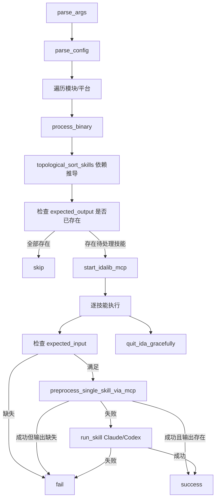

# ida_analyze_bin

## 概述
`ida_analyze_bin.py` 是 CS2 二进制签名分析的总编排入口：读取 `config.yaml` 后按模块/平台/技能顺序执行，优先走预处理，预处理失败时再调用 Claude/Codex 技能补全 YAML 输出；不再执行 postprocess 二次校验。

## 职责
- 解析 CLI 参数并生成运行上下文（平台过滤、模块过滤、`oldgamever` 推断、默认重试次数等）。
- 解析 `config.yaml` 的 `modules[*].skills[*]` 元数据，提取 `expected_input/expected_output/max_retries`（`prerequisite` 仅作兼容兜底）。
- 对每个二进制内的技能基于输入/输出依赖关系做拓扑排序与跳过判定（输出已存在则直接跳过）。
- 启动并管理 `idalib-mcp` 生命周期（启动等待、任务执行、优雅退出/强制回收）。
- 执行“预处理 -> 失败回退 Agent”的单阶段产出流程，并统计成功/失败/跳过数。
- 汇总成功/失败/跳过统计，并在存在失败时以非 0 退出码结束。

## 涉及文件 (不要带行号)
- ida_analyze_bin.py
- config.yaml
- ida_skill_preprocessor.py
- ida_analyze_util.py
- .claude/agents/sig-finder.md
- .claude/skills/<skill>/SKILL.md

## 架构
主入口以 `main -> process_binary -> (preprocess/run_skill)` 的分层方式工作：

关键实现点：
- `topological_sort_skills` 基于 `expected_output -> producer` 建索引，再用各技能 `expected_input` 反查生产者，推导依赖关系。
- 依赖匹配先走规范化后的完整路径（`normpath + normcase`），匹配不到再回退到文件名匹配（basename）。
- `prerequisite` 仍会被读取并合并进依赖图，作为旧配置兼容与补充机制。
- 排序采用 Kahn 算法，并对同层节点排序，保证执行顺序稳定。
- `run_skill` 按 `agent` 名称分流：
  - Claude：`--session-id/--resume` 复用会话重试。
  - Codex：读取 `.claude/agents/sig-finder.md`，去除 frontmatter 后通过 `developer_instructions=` 注入；重试时 `exec resume --last`。
- `process_binary` 中技能级 `max_retries` 可覆盖全局 `-maxretry`。
- 预处理成功后仍会检查 `expected_output` 是否落盘，缺失则记失败。

## 依赖
- 外部库：`pyyaml`、`httpx`、`mcp` Python SDK。
- 外部工具：`uv run idalib-mcp`、`claude` CLI 或 `codex` CLI。
- 内部模块：`ida_skill_preprocessor.preprocess_single_skill_via_mcp`。

## 注意事项
- `-oldgamever` 未显式指定时会尝试 `int(gamever)-1`；`gamever` 非数字则自动禁用旧版本复用。
- `old_binary_dir` 仅检查目录存在，不保证每个旧 YAML 存在；预处理脚本需自行处理旧文件缺失。
- `ida_args` 使用字符串 `split()`，对带空格或复杂引号参数不友好。
- `expected_input` 缺失会直接记失败，不会进入 Agent 回退路径。
- 预处理返回成功但输出文件缺失时会记失败，不会继续回退 Agent。
- MCP 启动失败时，该二进制下所有待处理技能直接计为失败。
- 若多个技能声明了同一产物，消费者会依赖全部匹配到的生产者，可能引入额外边；出现循环依赖时会告警并按原顺序兜底追加。

## 调用方（可选）
- 命令行直接执行：`python ida_analyze_bin.py -gamever 14135 [-agent=claude] [-platform windows] [-debug]`