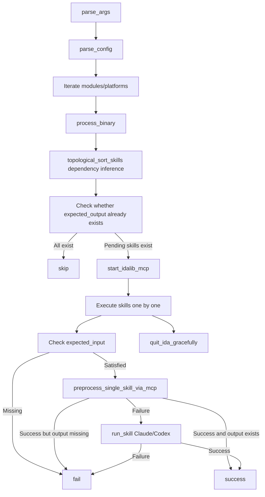

# ida_analyze_bin

## Overview
`ida_analyze_bin.py` 是 CS2 二进制分析的主 CLI 入口。它负责解析运行参数与环境变量回退、构建模块/平台/LLM 运行上下文，并驱动 `preprocess -> Agent fallback -> optional rename/comment post-process` 的整体流程；`README.md` 提供常用调用方式与部分环境变量说明。

## Responsibilities
- 解析 CLI 参数并派生运行时字段：`platforms`、`module_filter`、`vcall_finder_filter`、`oldgamever`、`llm_temperature`、`llm_fake_as`、`llm_effort`。
- 读取 `config.yaml` 中的模块与 skill 定义，按模块/平台遍历二进制并执行预处理、Agent 回退与统计汇总。
- 启动、保活、重启并优雅关闭 `idalib-mcp`，并在需要时执行 `vcall_finder` 聚合与 `-rename` 后处理。

## Involved Files & Symbols
- `ida_analyze_bin.py` - `parse_args`
- `ida_analyze_bin.py` - `resolve_oldgamever`
- `ida_analyze_bin.py` - `parse_vcall_finder_filter`
- `ida_analyze_bin.py` - `start_idalib_mcp`
- `ida_analyze_bin.py` - `process_binary`
- `ida_analyze_bin.py` - `main`
- `README.md` - `ida_analyze_bin.py` 命令示例、`-llm_*` 参数说明、IDA 预处理环境变量说明
- `config.yaml` - 模块与 skill 元数据输入
- `ida_skill_preprocessor.py` - `process_binary` 下游预处理阶段

## Architecture
主入口仍保持上一版 memory 记录的分层 workflow：`main -> process_binary -> (preprocess/run_skill)`；`parse_args()` 提供 CLI/环境变量上下文，`README.md` 补充常用调用方式与下游环境约定。

```mermaid
flowchart TD
  A["parse_args"] --> B["parse_config"]
  B --> C["Iterate modules/platforms"]
  C --> D["process_binary"]
  D --> E["topological_sort_skills dependency inference"]
  E --> F["Check whether expected_output already exists"]
  F -->|All exist| G["skip"]
  F -->|Pending skills exist| H["start_idalib_mcp"]
  H --> I["Execute skills one by one"]
  I --> J["Check expected_input"]
  J -->|Missing| K["fail"]
  J -->|Satisfied| L["preprocess_single_skill_via_mcp"]
  L -->|Success and output exists| O["success"]
  L -->|Success but output missing| K
  L -->|Failure| N["run_skill Claude/Codex"]
  N -->|Success| O
  N -->|Failure| K
  I --> Q["quit_ida_gracefully"]
```

Key implementation points:
- `topological_sort_skills` builds an index by `expected_output -> producer`, then reverse-maps each skill's `expected_input` to producers to infer dependencies.
- Dependency matching first uses normalized full path (`normpath + normcase`), and falls back to filename matching (`basename`) if full-path match fails.
- `prerequisite` is still read and merged into the dependency graph as a legacy compatibility/supplement mechanism.
- Sorting uses Kahn's algorithm, with same-layer node sorting to guarantee stable execution order.
- `run_skill` routes by `agent` name:
  - Claude: reuse session retries via `--session-id/--resume`.
  - Codex: read `.claude/agents/sig-finder.md`, strip frontmatter, inject via `developer_instructions=`, and on retry use `exec resume --last`.
- Skill-level `max_retries` in `process_binary` can override global `-maxretry`.
- After preprocessing succeeds, `expected_output` is still checked on disk; missing output is counted as failure.
- `-platform`、`-modules`、`-vcall_finder` 都先以字符串接收，再在 `parse_args()` 中规范化为派生字段。
- `-oldgamever` 若未显式传入，会调用 `resolve_oldgamever()` 在 `bin/<version>` 目录下寻找最近可用旧版本。
- `-llm_temperature`、`-llm_fake_as`、`-llm_effort` 在解析后会进入专门校验函数；其中 `fake_as` 仅允许 `codex`，`effort` 仅允许固定枚举值。
- `-rename` 不影响参数解析，但会在 `process_binary()` 中触发基于现有 YAML 的 rename/comment 后处理分支。

## Dependencies
- Python 库：`pyyaml`、`httpx`、`mcp` Python SDK
- 外部工具：`uv`、`idalib-mcp`、`claude` CLI 或 `codex` CLI
- 运行输入：`config.yaml`、`bin/<gamever>/...` 二进制、可选旧版本 YAML 产物

## Notes
- `-platform` 只接受 `windows` 与 `linux`，支持逗号分隔；非法值会直接 `parser.error(...)`。
- `-modules=*` 表示不过滤模块；否则按逗号分隔生成 `module_filter`。
- `-vcall_finder` 接受 `*` 或逗号分隔对象名；空字符串、空对象名、`*` 与对象名混用都会报错。
- `-oldgamever=none` 会显式禁用旧版本复用；未传时按目录存在性自动推断最近旧版本，支持 `14141a` 这类后缀版本。
- `-ida_args` 最终通过 `str.split()` 传给 `idalib-mcp`，带空格或复杂引号的参数不够稳健。
- 当前 `README.md` 的主命令示例覆盖了大多数常用参数，但源码还额外暴露了 `-bindir`、`-ida_args`、`-rename`。

## CLI Arguments
- `-configyaml`: 配置文件路径；默认 `config.yaml`。
- `-bindir`: 二进制根目录；默认 `bin`。
- `-gamever`: 目标游戏版本；若未设置 `CS2VIBE_GAMEVER` 则为必填。
- `-platform`: 目标平台列表；默认 `windows,linux`；解析后写入 `args.platforms`。
- `-agent`: 要调用的 Agent 可执行名；默认 `claude`；示例值包括 `claude`、`claude.cmd`、`codex`、`codex.cmd`。
- `-modules`: 模块过滤器；默认 `*`；可传逗号分隔模块名。
- `-vcall_finder`: vcall_finder 对象过滤器；支持 `*` 或逗号分隔对象名；解析后写入 `args.vcall_finder_filter`。
- `-llm_model`: LLM 模型名；默认 `gpt-4o`。
- `-llm_apikey`: LLM API Key；供预处理与 `vcall_finder` 聚合使用。
- `-llm_baseurl`: LLM Base URL；兼容 OpenAI 接口；当 `-llm_fake_as=codex` 时需要提供。
- `-llm_temperature`: 可选浮点数；空值会被视为未设置，非法数字会报错。
- `-llm_fake_as`: 可选兼容模式；仅允许 `codex`；空值会被视为未设置。
- `-llm_effort`: 可选 reasoning effort；默认 `medium`；允许 `none|minimal|low|medium|high|xhigh`。
- `-ida_args`: 透传给 `idalib-mcp` 的附加命令行参数。
- `-debug`: 打开调试输出。
- `-rename`: 对已存在的 expected-output YAML 执行 rename/comment 后处理。
- `-maxretry`: skill 执行最大重试次数；默认 `3`；单个 skill 的配置值可在后续流程中覆盖该全局值。
- `-oldgamever`: 旧版本号；默认自动推断；传 `none` 可禁用旧版本复用。

## Environment Variables
- `CS2VIBE_GAMEVER`: `-gamever` 的环境变量回退；若未设置，则必须显式传 `-gamever`。
- `CS2VIBE_AGENT`: `-agent` 的环境变量回退。
- `CS2VIBE_LLM_MODEL`: `-llm_model` 的环境变量回退。
- `CS2VIBE_LLM_APIKEY`: `-llm_apikey` 的环境变量回退。
- `CS2VIBE_LLM_BASEURL`: `-llm_baseurl` 的环境变量回退。
- `CS2VIBE_LLM_TEMPERATURE`: `-llm_temperature` 的环境变量回退；解析后仍需通过浮点校验。
- `CS2VIBE_LLM_FAKE_AS`: `-llm_fake_as` 的环境变量回退；解析后仅允许 `codex`。
- `CS2VIBE_LLM_EFFORT`: `-llm_effort` 的环境变量回退；解析后仅允许 `none|minimal|low|medium|high|xhigh`。
- `CS2VIBE_STRING_MIN_LENGTH`: 仅在 `README.md` 中记录的下游 IDA 预处理环境变量，用于控制字符串枚举时的 `minlen`；它不是 `parse_args()` 直接读取的参数回退。
- `OPENAI_API_KEY`、`OPENAI_API_BASE`、`OPENAI_API_MODEL`: `README.md` 明确说明 `ida_analyze_bin.py` 的 LLM 工作流不会读取这些通用 OpenAI 环境变量。

## Callers
- 直接 CLI 调用：`uv run ida_analyze_bin.py -gamever 14141 ...`
- 批处理/脚本封装：`README.md` 中的 Windows 流程示例会调用该脚本