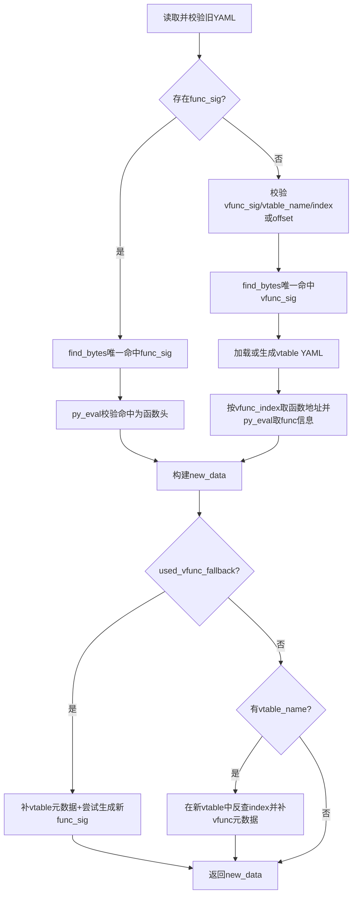

# preprocess_func_sig_via_mcp

## 概述
`preprocess_func_sig_via_mcp` 是 `ida_analyze_util.py` 中函数类输出的核心预处理入口。它优先复用旧版 `func_sig` 在新二进制中定位函数；当旧 YAML 没有 `func_sig` 时，退化到 `vfunc_sig + vtable 元数据` 路径，并尽可能自动再生成新的 `func_sig`。

## 职责
- 校验预处理前提（PyYAML、旧 YAML 路径与内容有效性）。
- 通过 MCP `find_bytes` 对 `func_sig/vfunc_sig` 做唯一命中验证。
- 通过 MCP `py_eval` 校验并解析函数头信息（`func_va`、`func_size`）。
- 在 vfunc 回退场景下，加载/生成对应 vtable YAML 并用 `vfunc_index` 反解函数地址。
- 组装标准函数 YAML 数据（`func_va/func_rva/func_size/func_sig`），并在需要时补充 `vtable_name/vfunc_offset/vfunc_index`。
- 当走 vfunc 回退时，调用 `preprocess_gen_func_sig_via_mcp` 自动重建 `func_sig`。

## 涉及文件 (不要带行号)
- ida_analyze_util.py
- ida_preprocessor_scripts/*.py

## 架构
该函数是一个“主路径 + 回退路径 + vtable 对齐”的决策树：

1. **输入与基础校验**
   - `yaml` 不可用、`old_path` 不存在、旧 YAML 解析失败/非 dict，直接失败返回 `None`。
   - 读取旧字段：`func_sig`、`vfunc_sig`、`vtable_name`。

2. **主路径（优先）: 使用旧 `func_sig`**
   - `_find_unique_match`：`find_bytes(limit=2)`，必须唯一命中。
   - `_get_func_info`：对命中地址执行 `py_eval`，且要求 `get_func(addr).start_ea == addr`（必须函数头）。
   - 成功后得到新的 `func_va/func_size`。

3. **回退路径: `func_sig` 缺失时使用 `vfunc_sig`**
   - 要求 `vfunc_sig` 与 `vtable_name` 存在。
   - 校验/归一化 `vfunc_index` 与 `vfunc_offset`：
     - 至少存在其一
     - `vfunc_offset` 必须 8 字节对齐
     - 最终满足 `vfunc_offset == vfunc_index * 8`
   - `_find_unique_match` 验证 `vfunc_sig` 唯一命中。
   - `_load_vtable_data(vtable_name)`：
     - 先查 `new_binary_dir/{vtable_name}_vtable.{platform}.yaml`
     - 若不存在则调用 `preprocess_vtable_via_mcp` 动态生成并 `write_vtable_yaml` 落盘
   - 从 `vtable_entries[vfunc_index]` 取函数地址，再 `_get_func_info` 获取函数头信息。

4. **结果构建与元数据补齐**
   - 基础输出：`func_va`、`func_rva`、`func_size`。
   - 若旧 `func_sig` 路径可用，保留该 `func_sig`。
   - 若为 vfunc 回退：
     - 输出 `vtable_name/vfunc_offset/vfunc_index`
     - 额外调用 `preprocess_gen_func_sig_via_mcp` 生成新 `func_sig`（失败仅打印 debug，不阻断返回）。

5. **vfunc 函数的交叉对齐（主路径附加步骤）**
   - 当旧 YAML 带 `vtable_name` 且主路径已解析出 `func_va`：
     - 重新加载/生成新 vtable YAML
     - 在 `vtable_entries` 中反查 `func_va` 的 index
     - 产出新的 `vfunc_offset/vfunc_index`

## 依赖
- 内部依赖：
  - `parse_mcp_result`
  - `preprocess_vtable_via_mcp`
  - `write_vtable_yaml`
  - `preprocess_gen_func_sig_via_mcp`
- MCP 工具：`find_bytes`、`py_eval`
- 标准库与三方：`os`、`json`、`yaml`（PyYAML）
- 资源依赖：`new_binary_dir` 下的 `*_vtable.{platform}.yaml`

## 注意事项
- **路径选择是单向的**：只要旧 YAML 存在 `func_sig`，函数就优先走主路径；即使该路径失败，也不会再自动尝试 `vfunc_sig` 回退。
- 唯一性要求严格：`find_bytes(limit=2)` 下必须恰好 1 个命中，否则立即失败。
- `_get_func_info` 要求命中地址就是函数头；签名若命中函数体中段会失败。
- `vfunc_offset/index` 默认按 8 字节步长处理，隐含 64 位 vtable 步长假设。
- `_load_vtable_data` 可能产生副作用：缺失 vtable YAML 时会现场生成并写盘。
- vfunc 回退中若新 `func_sig` 自动生成失败，不会回滚整个流程；会返回无 `func_sig` 或沿用已有字段的结果。

## 调用方（可选）
- 被大量 `ida_preprocessor_scripts/find-*.py` 的 `preprocess_skill` 直接调用，作为函数类输出的通用预处理主入口。