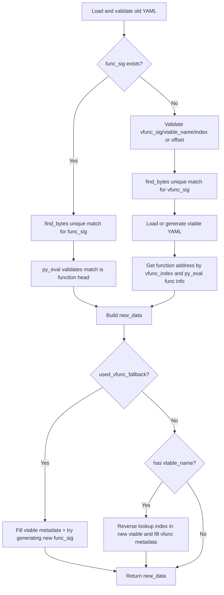

# preprocess_func_sig_via_mcp

## Overview
`preprocess_func_sig_via_mcp` is the core preprocessing entry for function-type outputs in `ida_analyze_util.py`. It prioritizes reusing the old `func_sig` to locate functions in the new binary; when old YAML has no `func_sig`, it falls back to the `vfunc_sig + vtable metadata` path and attempts to auto-generate a new `func_sig` whenever possible.

## Responsibilities
- Validate preprocessing prerequisites (PyYAML availability, old YAML path/content validity).
- Use MCP `find_bytes` to enforce unique-match validation for `func_sig/vfunc_sig`.
- Use MCP `py_eval` to validate and parse function header metadata (`func_va`, `func_size`).
- In vfunc fallback mode, load/generate the corresponding vtable YAML and resolve function address via `vfunc_index`.
- Build standard function YAML data (`func_va/func_rva/func_size/func_sig`), and add `vtable_name/vfunc_offset/vfunc_index` when needed.
- When vfunc fallback is used, call `preprocess_gen_func_sig_via_mcp` to auto-rebuild `func_sig`.

## Files Involved (no line numbers)
- ida_analyze_util.py
- ida_preprocessor_scripts/*.py

## Architecture
This function is a decision tree of "main path + fallback path + vtable alignment":

1. **Input and basic validation**
   - If `yaml` is unavailable, `old_path` does not exist, old YAML parse fails, or old YAML is not a dict, fail and return `None` directly.
   - Read old fields: `func_sig`, `vfunc_sig`, `vtable_name`.

2. **Main path (preferred): use old `func_sig`**
   - `_find_unique_match`: `find_bytes(limit=2)`, must be uniquely matched.
   - `_get_func_info`: run `py_eval` on matched address, requiring `get_func(addr).start_ea == addr` (must be function head).
   - On success, get new `func_va/func_size`.

3. **Fallback path: use `vfunc_sig` when `func_sig` is missing**
   - Requires both `vfunc_sig` and `vtable_name`.
   - Validate/normalize `vfunc_index` and `vfunc_offset`:
     - At least one of them must exist
     - `vfunc_offset` must be 8-byte aligned
     - Final constraint: `vfunc_offset == vfunc_index * 8`
   - `_find_unique_match` validates unique match for `vfunc_sig`.
   - `_load_vtable_data(vtable_name)`:
     - Check `new_binary_dir/{vtable_name}_vtable.{platform}.yaml` first
     - If missing, call `preprocess_vtable_via_mcp` to generate dynamically and persist via `write_vtable_yaml`
   - Get function address from `vtable_entries[vfunc_index]`, then call `_get_func_info` for function-head metadata.

4. **Result construction and metadata completion**
   - Base output: `func_va`, `func_rva`, `func_size`.
   - If old `func_sig` path is used, keep that `func_sig`.
   - If vfunc fallback is used:
     - Output `vtable_name/vfunc_offset/vfunc_index`
     - Additionally call `preprocess_gen_func_sig_via_mcp` to generate a new `func_sig` (failure only logs debug and does not block return).

5. **Cross-alignment for vfunc metadata (extra step on main path)**
   - When old YAML contains `vtable_name` and main path already resolved `func_va`:
     - Reload/generate new vtable YAML
     - Reverse-lookup index of `func_va` in `vtable_entries`
     - Produce new `vfunc_offset/vfunc_index`

## Dependencies
- Internal dependencies:
  - `parse_mcp_result`
  - `preprocess_vtable_via_mcp`
  - `write_vtable_yaml`
  - `preprocess_gen_func_sig_via_mcp`
- MCP tools: `find_bytes`, `py_eval`
- Stdlib and third-party: `os`, `json`, `yaml` (PyYAML)
- Resource dependency: `*_vtable.{platform}.yaml` under `new_binary_dir`

## Notes
- **Path selection is one-way**: as long as old YAML contains `func_sig`, it always takes the main path first; even if that path fails, it will not auto-fallback to `vfunc_sig`.
- Uniqueness is strict: under `find_bytes(limit=2)`, there must be exactly one match; otherwise fail immediately.
- `_get_func_info` requires the matched address to be function head; signatures matching mid-function will fail.
- `vfunc_offset/index` is handled with 8-byte stride by default, implicitly assuming 64-bit vtable entry width.
- `_load_vtable_data` may introduce side effects: when vtable YAML is missing, it generates and writes it on the spot.
- In vfunc fallback, if auto-generation of new `func_sig` fails, the whole flow is not rolled back; it may return without `func_sig` or with existing fields only.

## Callers (optional)
- Called directly by many `preprocess_skill` implementations in `ida_preprocessor_scripts/find-*.py` as the common preprocessing entry for function-type outputs.