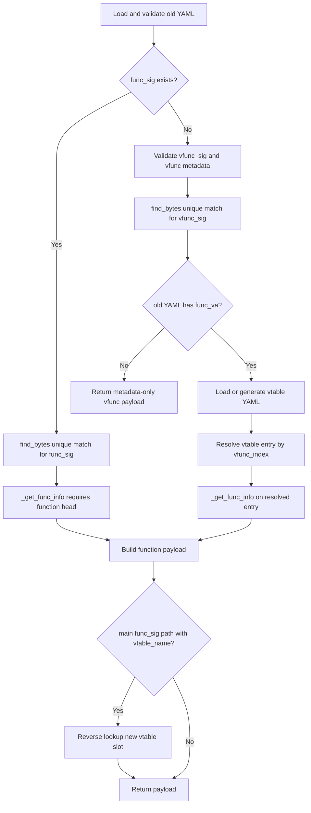

# preprocess_func_sig_via_mcp

## Overview
`preprocess_func_sig_via_mcp` 是 `ida_analyze_util.py` 中函数类 YAML 的主复用入口。它优先复用旧版 `func_sig`；若旧 YAML 没有 `func_sig`，则可回退到 `vfunc_sig + vtable metadata`，但当前实现已经不会在该回退路径里自动再生成新的 `func_sig`。

## Responsibilities
- 校验前置条件：PyYAML 可用性、旧 YAML 存在与可解析性、以及 `mangled_class_names` 的归一化结果。
- 通过 MCP `find_bytes` + `_get_func_info` 复用旧 `func_sig`，并要求唯一命中且命中点必须是函数头。
- 当 `func_sig` 缺失时，校验 `vfunc_sig/vtable_name/vfunc_index/vfunc_offset`，并借助新版本 vtable YAML 解析目标函数。
- 在缺失 vtable YAML 时，调用 `preprocess_vtable_via_mcp` + `write_vtable_yaml` 现场生成，并在有别名时透传 mangled symbol aliases。
- 生成标准函数 YAML 数据；如果主路径已有 `vtable_name`，会反查新 vtable 并补全 `vfunc_offset/vfunc_index`。
- 对没有旧 `func_va` 的纯元数据 vfunc 条目，只保留并回写 `vfunc_sig/vtable_name/vfunc_offset/vfunc_index`。

## Involved Files & Symbols
- `ida_analyze_util.py` - `preprocess_func_sig_via_mcp`
- `ida_analyze_util.py` - `preprocess_vtable_via_mcp`
- `ida_analyze_util.py` - `write_vtable_yaml`
- `ida_analyze_util.py` - `_normalize_mangled_class_names`
- `ida_analyze_util.py` - `_get_mangled_class_aliases`

## Architecture
1. 输入校验
   - 若 PyYAML 不可用、`old_path` 不存在、旧 YAML 不能解析成 dict，或 `mangled_class_names` 归一化失败，则直接返回 `None`。
2. 主路径：旧 `func_sig`
   - `find_bytes(limit=2)` 必须唯一命中。
   - `_get_func_info` 要求命中地址就是函数头，并返回 `func_va/func_size`。
3. 回退路径：旧 YAML 没有 `func_sig`
   - 必须有 `vfunc_sig`、`vtable_name`，以及 `vfunc_index` / `vfunc_offset` 至少一个。
   - 使用 8 字节步长规范化 slot 元数据，并强制满足 `vfunc_offset == vfunc_index * 8`。
   - `find_bytes(limit=2)` 必须唯一命中 `vfunc_sig`。
   - 如果旧 YAML 没有 `func_va`，在这里直接返回只含 `func_name/vfunc_sig/vtable_name/vfunc_offset/vfunc_index` 的元数据结果，不再解析 vtable。
   - 否则从 `new_binary_dir` 读取 `{vtable_name}_vtable.{platform}.yaml`；缺失时现场生成，再按 `vfunc_index` 定位函数地址并调用 `_get_func_info`。
4. 结果组装
   - 能解析出具体函数时，都会返回 `func_name`。
   - 主 `func_sig` 路径保留旧 `func_sig`。
   - vfunc 回退路径保留 `vfunc_sig/vtable_name/vfunc_offset/vfunc_index`。
5. 主路径的额外 vtable 对齐
   - 若主路径已有 `vtable_name`，会重新加载或生成新 vtable YAML，反查 `func_va` 在新 `vtable_entries` 中的索引，并写回新的 `vfunc_offset/vfunc_index`。

```mermaid
flowchart TD
    A[Load and validate old YAML] --> B{func_sig exists?}
    B -- Yes --> C[find_bytes unique match for func_sig]
    C --> D[_get_func_info requires function head]
    B -- No --> E[Validate vfunc_sig and vfunc metadata]
    E --> F[find_bytes unique match for vfunc_sig]
    F --> G{old YAML has func_va?}
    G -- No --> H[Return metadata-only vfunc payload]
    G -- Yes --> I[Load or generate vtable YAML]
    I --> J[Resolve vtable entry by vfunc_index]
    J --> K[_get_func_info on resolved entry]
    D --> L[Build function payload]
    K --> L
    L --> M{main func_sig path with vtable_name?}
    M -- Yes --> N[Reverse lookup new vtable slot]
    M -- No --> O[Return payload]
    N --> O
```

## Dependencies
- Internal: `parse_mcp_result`, `preprocess_vtable_via_mcp`, `write_vtable_yaml`, `_normalize_mangled_class_names`, `_get_mangled_class_aliases`
- MCP: `find_bytes`, `py_eval`
- Stdlib / third-party: `os`, `json`, `yaml`
- Resource dependency: old YAML，以及可选的当前版本 `*_vtable.{platform}.yaml`

## Notes
- 路径选择仍然是单向的：只要旧 YAML 里存在 `func_sig`，主路径失败后不会自动回退到 `vfunc_sig`。
- `_get_func_info` 要求命中地址必须是函数头，中段命中会被拒绝。
- vtable slot 计算仍写死为 8 字节步长。
- `_load_vtable_data` 有副作用：缺失时会现场生成并写出 vtable YAML。
- 如果旧 YAML 没有 `func_va`，该函数仍可能成功，但结果只包含 vfunc 元数据，不含 `func_va/func_rva/func_size`。
- 当前实现不会在 vfunc 回退路径中调用 `preprocess_gen_func_sig_via_mcp`。

## Callers
- `ida_analyze_util.py` 中的 `preprocess_common_skill` 把它作为普通 func 流水线的主入口。
- `ida_analyze_util.py` 中的 `preprocess_common_skill` 也会在 inherited-vfunc fallback 之前先走它作为 fast path。
- `tests/test_ida_analyze_util.py` 对其直接行为有覆盖。
