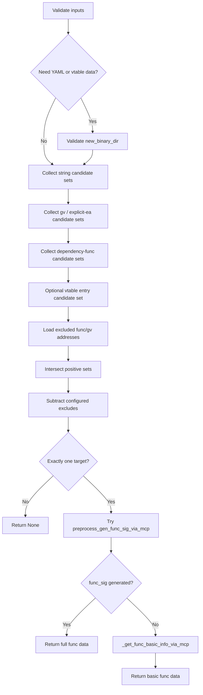

# preprocess_func_xrefs_via_mcp

## Overview
`preprocess_func_xrefs_via_mcp` 是 `ida_analyze_util.py` 中统一的 xref 函数定位入口。它会把字符串引用、依赖函数或全局变量地址的 xref、以及可选的 vtable entries 候选集求交，再减去排除函数，最后尝试生成新的 `func_sig`。

## Responsibilities
- 校验 `xref_strings/xref_gvs/xref_funcs/exclude_funcs/exclude_gvs` 输入，以及仅在符号 YAML / vtable 模式下对 `new_binary_dir` 的前置要求。
- 通过 `_collect_xref_func_starts_for_string` 收集字符串引用对应的函数起始地址集合。
- 通过 `_collect_xref_func_starts_for_ea` 收集依赖地址的引用函数集合；`xref_gvs` / `exclude_gvs` 既支持从当前版本 YAML 读取 `gv_va`，也支持直接使用显式 `0x...` 地址。
- 在给定 `vtable_class` 时，把 `{vtable_class}_vtable.{platform}.yaml` 的全部 `vtable_entries` 作为额外正向候选集。
- 在唯一性校验前，先从当前版本 YAML 读取 `exclude_funcs` 的 `func_va` 并做差集过滤。
- 在锁定唯一目标后，优先调用 `preprocess_gen_func_sig_via_mcp`，失败时回退到 `_get_func_basic_info_via_mcp`。

## Involved Files & Symbols
- `ida_analyze_util.py` - `preprocess_func_xrefs_via_mcp`
- `ida_analyze_util.py` - `_load_gv_or_explicit_ea`
- `ida_analyze_util.py` - `_is_explicit_address_literal`
- `ida_analyze_util.py` - `_collect_xref_func_starts_for_string`
- `ida_analyze_util.py` - `_collect_xref_func_starts_for_ea`
- `ida_analyze_util.py` - `_get_func_basic_info_via_mcp`

## Architecture
1. 校验条件性前置要求
   - 只要使用 `xref_funcs`、`exclude_funcs`、`vtable_class`，或 `xref_gvs` / `exclude_gvs` 中包含非显式地址字面量的符号名，就必须提供可用的 `new_binary_dir`。
2. 构建正向候选集
   - 若提供 `vtable_class`，先读取 `{vtable_class}_vtable.{platform}.yaml`，把全部 `vtable_entries` 地址作为一个候选集。
   - 对 `xref_strings` 中每个字符串调用 `_collect_xref_func_starts_for_string`。
   - 对 `xref_gvs` 中每个条目，若是 `0x...` 则直接解析为 EA；否则读取 `{symbol}.{platform}.yaml` 的 `gv_va`，再调用 `_collect_xref_func_starts_for_ea`。
   - 对 `xref_funcs` 中每个函数名，读取 `{func_name}.{platform}.yaml` 的 `func_va`，再调用 `_collect_xref_func_starts_for_ea`。
3. 构建负向过滤集
   - 对 `exclude_funcs` 中每个函数名，读取当前版本 YAML 并收集其 `func_va`。
   - 对 `exclude_gvs` 中每个条目，若是 `0x...` 则直接解析为 EA；否则读取当前版本 YAML 的 `gv_va`，再收集对应 xref 函数集合。
4. 锁定目标
   - 对所有正向候选集做求交。
   - 从交集里减去 `exclude_funcs`、`exclude_strings`、`exclude_gvs` 命中的函数地址。
   - 最终必须只剩 1 个函数起始地址。
5. 产出 YAML 数据
   - 先尝试 `preprocess_gen_func_sig_via_mcp`。
   - 若成功生成 `func_sig`，补上 `func_name` 后直接返回。
   - 若生成失败，则回退到 `_get_func_basic_info_via_mcp`，返回基础元数据与 `func_name`。

## Dependencies
- Internal: `_read_yaml_file`, `_parse_int_value`, `_is_explicit_address_literal`, `_load_gv_or_explicit_ea`, `_collect_xref_func_starts_for_string`, `_collect_xref_func_starts_for_ea`, `_get_func_basic_info_via_mcp`, `preprocess_gen_func_sig_via_mcp`
- MCP: `py_eval`（通过 helper 间接使用）, `find_bytes`（在 `preprocess_gen_func_sig_via_mcp` 中使用）
- Resource dependency: 当前版本 `*.{platform}.yaml` 函数产物、符号型 gv 产物，以及可选的 `*_vtable.{platform}.yaml`

## Notes
- `_collect_xref_func_starts_for_string` 当前使用的是子串匹配（`search_str in str(s)`），不是精确字符串相等匹配。
- 纯字符串模式、纯显式 `0x...` gv 模式都不要求 `new_binary_dir`；只有符号 YAML / vtable 支撑的模式才要求。
- 显式地址字面量目前按 `0x` 前缀判定，并通过 `_parse_int_value` 解析。
- 唯一性是在排除过滤之后检查，因此 `exclude_funcs` / `exclude_gvs` 可以用于拆解原本并列的候选函数。
- 如果签名生成失败，该函数仍可能返回 `func_va/func_rva/func_size`，只是没有 `func_sig`。

## Callers
- `ida_analyze_util.py` 中的 `preprocess_common_skill` 把它作为统一的 func xref fallback。
