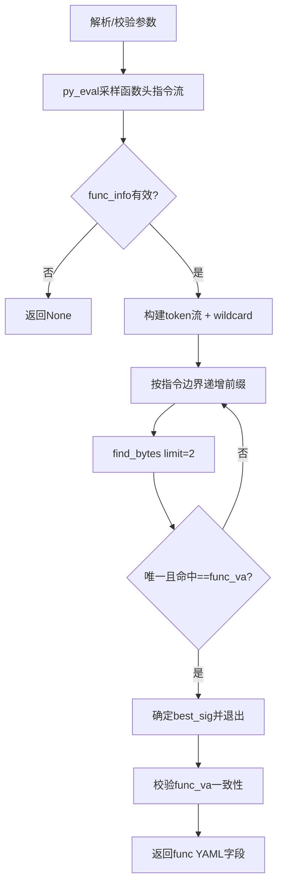

# preprocess_gen_func_sig_via_mcp

## 概述
`preprocess_gen_func_sig_via_mcp` 是 `ida_analyze_util.py` 中用于“基于已知函数入口地址生成最短唯一函数头签名”的异步预处理函数。它只接受函数头作为锚点，逐步增长签名前缀并验证唯一性，最终返回函数 YAML 所需字段（`func_va/func_rva/func_size/func_sig`）。

## 职责
- 解析并校验输入参数（`func_va`、长度限制、额外通配偏移）。
- 通过 MCP `py_eval` 在 IDA 侧采集函数头开始的指令流及每条指令的通配字节集合。
- 在 Python 侧按“完整指令边界”逐步增长签名前缀，通过 MCP `find_bytes` 验证唯一命中。
- 强制验证命中地址必须等于目标函数入口，避免命中函数中段。
- 生成并返回可直接供 `write_func_yaml` 使用的函数签名数据。

## 涉及文件 (不要带行号)
- ida_analyze_util.py
- ida_preprocessor_scripts/find-CTriggerPush_Touch.py

## 架构
整体是“IDA 采样 + 本地递增验证”的两阶段流程：

1. **参数标准化与校验**
   - 内部 `_parse_int/_parse_addr` 统一处理 `int/hex-string`。
   - 约束 `min_sig_bytes/max_sig_bytes/max_instructions >= 1`。
   - `extra_wildcard_offsets` 仅接受非负偏移并转为集合。

2. **IDA 侧采样（`py_eval`）**
   - 校验 `func_va` 必须是函数头：`get_func(target_ea)` 且 `f.start_ea == target_ea`。
   - 从函数头开始，按 `max_sig_bytes` 与 `max_instructions` 采集指令。
   - 对每条指令计算 `wild`：
     - 操作数相关字节（`o_imm/o_near/o_far/o_mem/o_displ`，基于 `offb/offo + dtype`）
     - 控制流相对位移字节（`E8/E9/EB`、`0F 8x`、`70-7F`）
   - 返回 `func_va`、`func_size`、`insts[{ea,size,bytes,wild}]`。

3. **Python 侧签名构建与最短化搜索**
   - 将 `insts` 展平为 token 流（十六进制字节/`??`），并合并 `extra_wildcard_offsets`。
   - 每处理完一条指令记录一次边界，仅在这些边界尝试前缀（保证按指令粒度增长）。
   - 从满足 `min_sig_bytes` 的最短前缀开始调用 `find_bytes(limit=2)`：
     - 需要唯一命中（`n == 1`）
     - 且唯一命中地址必须等于 `func_va`
   - 第一个满足条件的前缀即视为“当前采样窗口内最短可用 `func_sig`”。

4. **结果一致性校验与输出**
   - 校验 `py_eval` 返回的 `func_va` 与输入目标一致。
   - 返回：`func_va`、`func_rva`（`func_va - image_base`）、`func_size`、`func_sig`。

## 依赖
- 内部依赖：`parse_mcp_result`（统一解析 `py_eval/find_bytes` 返回）
- MCP 工具：`py_eval`、`find_bytes`
- IDA Python API（`py_eval` 脚本内）：`idaapi`、`ida_bytes`、`idautils`、`ida_ua`
- 标准库：`json`
- 下游契约：返回字段与 `write_func_yaml` 的 key 集合兼容

## 注意事项
- `func_va` 必须是函数入口；如果传入中间地址会在 IDA 侧校验失败并返回 `None`。
- 最短搜索仅在“采样到的指令边界”内进行；若 `max_sig_bytes/max_instructions` 过小，可能找不到唯一签名。
- `extra_wildcard_offsets` 作用于“相对函数头的绝对偏移”；配置过宽会显著降低唯一性。
- 即使签名唯一，也必须命中函数头地址；唯一命中到函数体中段同样会被拒绝。
- 该函数不直接写文件，只返回数据；实际落盘通常由上层 `write_func_yaml` 完成。

## 调用方（可选）
- `ida_analyze_util.py` 的 `preprocess_func_sig_via_mcp`：在 vfunc fallback 分支中生成新的 `func_sig`
- `ida_preprocessor_scripts/find-CTriggerPush_Touch.py`：当 `preprocess_func_sig_via_mcp` 失败且通过 vtable 回退定位到函数地址后，直接调用本函数重建签名