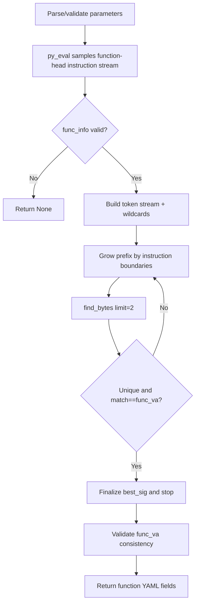

# preprocess_gen_func_sig_via_mcp

## Overview
`preprocess_gen_func_sig_via_mcp` is an async preprocessing function in `ida_analyze_util.py` for generating the shortest unique function-prologue signature from a known function entry address. It accepts only function heads as anchors, grows signature prefixes incrementally, validates uniqueness, and finally returns fields required by function YAML (`func_va/func_rva/func_size/func_sig`).

## Responsibilities
- Parse and validate input parameters (`func_va`, length limits, extra wildcard offsets).
- Use MCP `py_eval` to collect instruction stream starting from function head in IDA, including per-instruction wildcard byte sets.
- Incrementally grow signature prefix on complete-instruction boundaries in Python, and validate unique match via MCP `find_bytes`.
- Enforce that matched address must equal target function entry, avoiding mid-function matches.
- Generate and return function-signature data that can be used directly by `write_func_yaml`.

## Files Involved (no line numbers)
- ida_analyze_util.py
- ida_preprocessor_scripts/find-CTriggerPush_Touch.py

## Architecture
Overall flow is a two-phase pipeline: "IDA sampling + local incremental validation":

1. **Parameter normalization and validation**
   - Internal `_parse_int/_parse_addr` normalizes `int/hex-string`.
   - Enforce `min_sig_bytes/max_sig_bytes/max_instructions >= 1`.
   - `extra_wildcard_offsets` accepts only non-negative offsets and converts to a set.

2. **IDA-side sampling (`py_eval`)**
   - Validate `func_va` must be a function head: `get_func(target_ea)` and `f.start_ea == target_ea`.
   - Starting from function head, collect instructions under `max_sig_bytes` and `max_instructions` limits.
   - For each instruction, compute `wild`:
     - Operand-related bytes (`o_imm/o_near/o_far/o_mem/o_displ`, based on `offb/offo + dtype`)
     - Control-flow relative displacement bytes (`E8/E9/EB`, `0F 8x`, `70-7F`)
   - Return `func_va`, `func_size`, `insts[{ea,size,bytes,wild}]`.

3. **Python-side signature construction and shortest search**
   - Flatten `insts` into token stream (hex bytes / `??`), and merge `extra_wildcard_offsets`.
   - Record one boundary after each processed instruction, and only test prefixes at these boundaries (instruction-granularity growth).
   - Starting from the shortest prefix satisfying `min_sig_bytes`, call `find_bytes(limit=2)`:
     - Must be uniquely matched (`n == 1`)
     - Unique match address must equal `func_va`
   - The first qualifying prefix is treated as the shortest usable `func_sig` within current sampling window.

4. **Consistency validation and output**
   - Validate `func_va` returned by `py_eval` matches input target.
   - Return: `func_va`, `func_rva` (`func_va - image_base`), `func_size`, `func_sig`.

## Dependencies
- Internal dependency: `parse_mcp_result` (unified parsing for `py_eval/find_bytes` returns)
- MCP tools: `py_eval`, `find_bytes`
- IDA Python API (inside `py_eval` script): `idaapi`, `ida_bytes`, `idautils`, `ida_ua`
- Standard library: `json`
- Downstream contract: returned fields are compatible with `write_func_yaml` key set

## Notes
- `func_va` must be a function entry; passing a mid-function address fails validation in IDA and returns `None`.
- Shortest search is limited to sampled instruction boundaries; if `max_sig_bytes/max_instructions` is too small, no unique signature may be found.
- `extra_wildcard_offsets` applies to absolute offsets relative to function start; overly broad settings can significantly reduce uniqueness.
- Even if a signature is unique, it must still match function-head address; unique mid-function matches are rejected.
- This function does not write files directly; it only returns data. Actual persistence is usually done by upper-layer `write_func_yaml`.

## Callers (optional)
- `preprocess_func_sig_via_mcp` in `ida_analyze_util.py`: generates new `func_sig` in vfunc fallback branch
- `ida_preprocessor_scripts/find-CTriggerPush_Touch.py`: when `preprocess_func_sig_via_mcp` fails and function address is resolved via vtable fallback, this function is called directly to rebuild signature