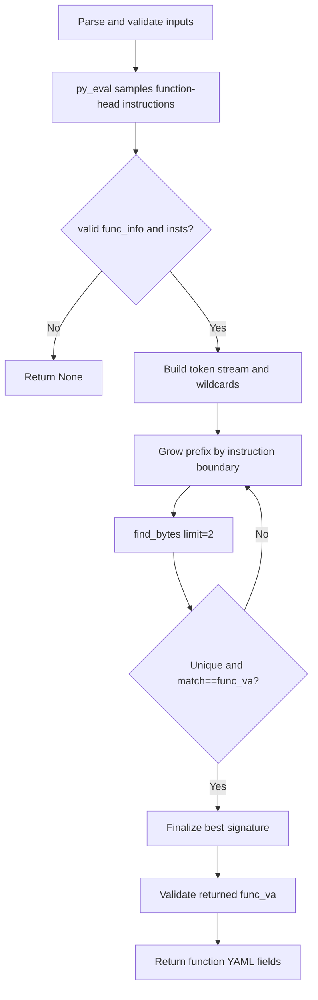

# preprocess_gen_func_sig_via_mcp

## Overview
`preprocess_gen_func_sig_via_mcp` 是 `ida_analyze_util.py` 中的异步 helper，用于从已知函数入口地址生成最短唯一的函数头签名。它先在 IDA 中采样指令流并标记可变字节，再只按完整指令边界增长候选签名，最终返回可直接写入函数 YAML 的字段。

## Responsibilities
- 解析并校验 `func_va`、长度限制以及 `extra_wildcard_offsets`。
- 通过 MCP `py_eval` 从函数头采样指令流。
- 标记操作数字节与控制流相对位移字节为 wildcard。
- 只在完整指令边界上增长签名前缀，并用 MCP `find_bytes` 做唯一性验证。
- 强制唯一命中地址必须等于目标函数入口地址。
- 返回 `func_va/func_rva/func_size/func_sig` 给上层写 YAML。

## Involved Files & Symbols
- `ida_analyze_util.py` - `preprocess_gen_func_sig_via_mcp`

## Architecture
1. 参数归一化与校验
   - 解析 `func_va` 与各类长度参数。
   - 只保留非负的 `extra_wildcard_offsets`。
2. IDA 侧采样（`py_eval`）
   - 先校验 `func_va` 必须是函数头。
   - 从函数入口向后采样至 `max_sig_bytes` / `max_instructions` 限制。
   - 为每条指令记录原始字节与 wildcard 位置。
3. Python 侧最短搜索
   - 把采样结果压平成 token 流。
   - 在绝对偏移上叠加 `extra_wildcard_offsets`。
   - 只测试落在完整指令边界上的前缀。
   - 要求 `find_bytes(limit=2)` 唯一命中，且命中地址必须等于 `func_va`。
4. 结果组装
   - 再次校验返回的 `func_va`。
   - 返回 `func_va`、`func_rva`、`func_size`、`func_sig`。

```mermaid
flowchart TD
    A[Parse and validate inputs] --> B[py_eval samples function-head instructions]
    B --> C{valid func_info and insts?}
    C -- No --> Z[Return None]
    C -- Yes --> D[Build token stream and wildcards]
    D --> E[Grow prefix by instruction boundary]
    E --> F[find_bytes limit=2]
    F --> G{Unique and match==func_va?}
    G -- No --> E
    G -- Yes --> H[Finalize best signature]
    H --> I[Validate returned func_va]
    I --> J[Return function YAML fields]
```

## Dependencies
- Internal: `parse_mcp_result`
- MCP: `py_eval`, `find_bytes`
- IDA Python API（在 `py_eval` 中）: `idaapi`, `ida_bytes`, `idautils`, `ida_ua`
- Stdlib: `json`

## Notes
- `func_va` 必须是函数入口；中途地址会校验失败。
- 最短搜索范围受采样字节数 / 指令数限制，限制过小会导致生成失败。
- `extra_wildcard_offsets` 是相对函数起点的绝对偏移；过度 wildcard 会破坏唯一性。
- 即使某个签名唯一，只要命中地址不是目标函数头，也会被拒绝。
- 该函数本身不写文件，落盘由上层调用者完成。

## Callers
- `ida_analyze_util.py` 中的 `preprocess_index_based_vfunc_via_mcp` 会在 inherited-vfunc fallback 找到 slot 且没有可复用旧 `func_sig` 时调用它。
- `ida_analyze_util.py` 中的 `preprocess_func_xrefs_via_mcp` 会在 xref 定位出唯一函数后调用它。
