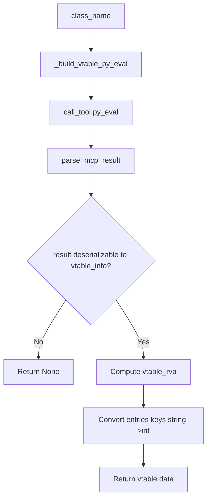

# preprocess_vtable_via_mcp

## Overview
`preprocess_vtable_via_mcp` is an async preprocessing function in `ida_analyze_util.py` used to parse vtable information directly by class name. It does not depend on old YAML; instead, it executes a unified template script inside IDA via MCP `py_eval` and returns structured data that can be written directly to vtable YAML.

## Responsibilities
- Accept `class_name` and build the corresponding IDA `py_eval` query script.
- Invoke MCP `py_eval` to execute vtable locating and entry extraction.
- Parse and validate `py_eval` return payload (JSON string).
- Compute `vtable_rva` based on `image_base`.
- Handle key-type conversion caused by JSON serialization (convert `vtable_entries` keys from string back to integer).
- Return a normalized vtable data dictionary for upper-layer persistence.

## Files Involved (no line numbers)
- ida_analyze_util.py
- ida_preprocessor_scripts/*_vtable.py

## Architecture
The function body is short, but depends on a relatively complete IDA-side template workflow:

1. **Build py_eval code**
   - `_build_vtable_py_eval(class_name)` replaces `CLASS_NAME_PLACEHOLDER` in `_VTABLE_PY_EVAL_TEMPLATE` with target class name.

2. **Execute MCP call**
   - `session.call_tool(name="py_eval", arguments={"code": py_code})`.
   - Parse one layer of MCP result wrapper using `parse_mcp_result`.

3. **Parse `result` field from py_eval**
   - Expect `result_data` to be a dict containing `result` (JSON string).
   - Deserialize `result` into `vtable_info`.

4. **Normalize result and return**
   - `vtable_rva = int(vtable_va, 16) - image_base`.
   - Convert `vtable_entries` keys from JSON strings back to `int`.
   - Return fields:
     - `vtable_class`
     - `vtable_symbol`
     - `vtable_va`
     - `vtable_rva`
     - `vtable_size`
     - `vtable_numvfunc`
     - `vtable_entries`

### Core strategy in IDA-side `_VTABLE_PY_EVAL_TEMPLATE`
- Try direct symbol lookup first:
  - Windows: `??_7<Class>@@6B@`
  - Linux: `_ZTV<len><Class>` (with Linux vtable start adjustment `+0x10`)
- If direct lookup fails, use RTTI fallback:
  - Windows: infer via `??_R4<Class>@@6B@` + `.rdata` refs
  - Linux: infer via `_ZTI<len><Class>` refs and offset-to-top rules
- Parse vtable entries:
  - Iterate by pointer width (32/64-bit)
  - Accept only function/code addresses
  - Handle Linux `_ZTV/_ZTI` boundaries and `0` entries

## Dependencies
- Internal dependencies:
  - `_build_vtable_py_eval`
  - `_VTABLE_PY_EVAL_TEMPLATE`
  - `parse_mcp_result`
- MCP tool: `py_eval`
- Standard library: `json`
- IDA API (inside template script): `ida_bytes`, `ida_name`, `idaapi`, `idautils`, `ida_segment`

## Notes
- This function currently ignores `platform` parameter (`_ = platform`); platform differences are mainly handled by symbol rules inside the template.
- `image_base` must support integer subtraction, otherwise `vtable_rva` computation fails.
- Key result fields (e.g., `vtable_va`, `vtable_class`) are accessed by direct indexing; abnormal `py_eval` return structure may raise exceptions instead of returning `None`.
- Converting `vtable_entries` keys to `int` depends on keys being parseable by `int()`; malformed data can cause failure.
- This function only returns data and does not write files; upper layer usually persists via `write_vtable_yaml`.

## Callers (optional)
- Many `ida_preprocessor_scripts/find-*_vtable.py` call this function directly in `preprocess_skill`, then call `write_vtable_yaml` to persist.
- `preprocess_func_sig_via_mcp/_load_vtable_data` in `ida_analyze_util.py` calls this function for on-demand generation when vtable YAML is missing.