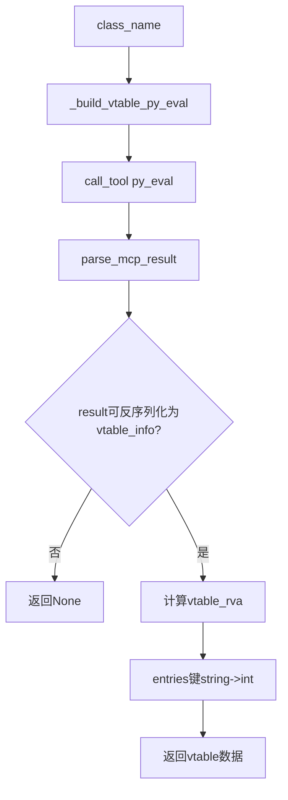

# preprocess_vtable_via_mcp

## 概述
`preprocess_vtable_via_mcp` 是 `ida_analyze_util.py` 中用于“按类名直接解析 vtable 信息”的异步预处理函数。它不依赖旧版 YAML，而是通过 MCP `py_eval` 在 IDA 内执行统一模板脚本，返回可直接用于 vtable YAML 的结构化数据。

## 职责
- 接收 `class_name` 并构建对应的 IDA `py_eval` 查询脚本。
- 调用 MCP `py_eval` 执行 vtable 定位与条目提取。
- 解析并校验 `py_eval` 返回结果（JSON 字符串）。
- 基于 `image_base` 计算 `vtable_rva`。
- 处理 JSON 序列化导致的键类型变化（`vtable_entries` 的 key 从字符串转回整数）。
- 返回统一的 vtable 数据字典供上层写盘。

## 涉及文件 (不要带行号)
- ida_analyze_util.py
- ida_preprocessor_scripts/*_vtable.py

## 架构
函数本体较短，但依赖一个较完整的 IDA 侧模板流程：

1. **构建 py_eval 代码**
   - `_build_vtable_py_eval(class_name)` 将 `_VTABLE_PY_EVAL_TEMPLATE` 中的 `CLASS_NAME_PLACEHOLDER` 替换为目标类名。

2. **执行 MCP 调用**
   - `session.call_tool(name="py_eval", arguments={"code": py_code})`。
   - 通过 `parse_mcp_result` 解析一层 MCP 返回包装。

3. **解析 py_eval 的 `result` 字段**
   - 期望 `result_data` 是 dict，且包含 `result`（JSON 字符串）。
   - 将 `result` 反序列化为 `vtable_info`。

4. **结果标准化与返回**
   - `vtable_rva = int(vtable_va, 16) - image_base`。
   - `vtable_entries` 的 key 由 JSON 字符串转回 `int`。
   - 返回字段：
     - `vtable_class`
     - `vtable_symbol`
     - `vtable_va`
     - `vtable_rva`
     - `vtable_size`
     - `vtable_numvfunc`
     - `vtable_entries`

### IDA 侧 `_VTABLE_PY_EVAL_TEMPLATE` 核心策略
- 先直查符号：
  - Windows：`??_7<Class>@@6B@`
  - Linux：`_ZTV<len><Class>`（并对 Linux vtable 起点做 `+0x10` 调整）
- 若直查失败，走 RTTI 回退：
  - Windows：`??_R4<Class>@@6B@` + `.rdata` 引用推断
  - Linux：`_ZTI<len><Class>` 引用与 offset-to-top 规则推断
- 解析 vtable entries：
  - 按指针宽度遍历（32/64 位）
  - 仅接受函数地址/代码地址
  - 针对 Linux 处理 `_ZTV/_ZTI` 边界与 `0` 条目

## 依赖
- 内部依赖：
  - `_build_vtable_py_eval`
  - `_VTABLE_PY_EVAL_TEMPLATE`
  - `parse_mcp_result`
- MCP 工具：`py_eval`
- 标准库：`json`
- IDA API（模板脚本中）：`ida_bytes`、`ida_name`、`idaapi`、`idautils`、`ida_segment`

## 注意事项
- 该函数当前忽略 `platform` 参数（`_ = platform`），平台差异主要由模板内部符号规则自动处理。
- `image_base` 必须可参与整数减法，否则 `vtable_rva` 计算会失败。
- 结果字典的关键字段（如 `vtable_va`、`vtable_class`）采用直接索引访问；若 `py_eval` 返回结构异常，可能抛出异常而非返回 `None`。
- `vtable_entries` 转换为 `int` key 依赖键可被 `int()` 解析；异常数据会导致失败。
- 该函数只返回数据，不负责落盘；通常由上层 `write_vtable_yaml` 写出文件。

## 调用方（可选）
- 大量 `ida_preprocessor_scripts/find-*_vtable.py` 在 `preprocess_skill` 中直接调用该函数，再调用 `write_vtable_yaml` 写盘。
- `ida_analyze_util.py` 的 `preprocess_func_sig_via_mcp/_load_vtable_data` 在缺失 vtable YAML 时调用该函数做“按需生成”。