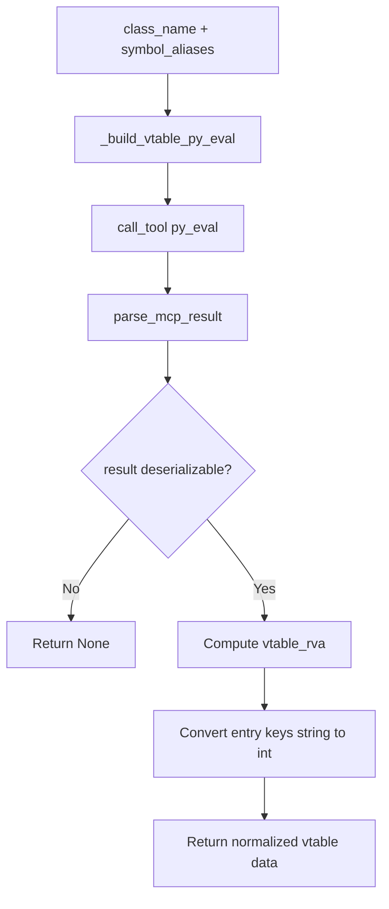

# preprocess_vtable_via_mcp

## Overview
`preprocess_vtable_via_mcp` 是 `ida_analyze_util.py` 中按类名解析 vtable 的异步 helper，并支持可选的显式 mangled symbol aliases。它不依赖旧 YAML，而是通过 MCP `py_eval` 执行统一模板脚本，再把返回结果规范化为可写入 vtable YAML 的结构。

## Responsibilities
- 接收 `class_name` 与可选的 `symbol_aliases`，构造对应的 IDA 查询脚本。
- 调用 MCP `py_eval` 并解析外层返回包装。
- 把模板返回的 JSON 字符串反序列化成结构化 vtable 信息。
- 基于 `image_base` 计算 `vtable_rva`。
- 把 JSON 序列化导致的 `vtable_entries` 字符串 key 转回整数。
- 返回可直接交给 `write_vtable_yaml` 的标准化结果。

## Involved Files & Symbols
- `ida_analyze_util.py` - `preprocess_vtable_via_mcp`
- `ida_analyze_util.py` - `_build_vtable_py_eval`
- `ida_analyze_util.py` - `_VTABLE_PY_EVAL_TEMPLATE`

## Architecture
1. 构造 `py_eval` 代码
   - `_build_vtable_py_eval(class_name, symbol_aliases)` 会同时注入 `CLASS_NAME_PLACEHOLDER` 与 `CANDIDATE_SYMBOLS_PLACEHOLDER`。
2. 执行 MCP 调用
   - 运行 `session.call_tool(name="py_eval", arguments={"code": py_code})`。
   - 用 `parse_mcp_result` 去掉一层返回包装。
3. 解析模板结果
   - 期望拿到带有 `result` JSON 字符串的 dict。
   - 反序列化为 `vtable_info`。
4. 规范化并返回
   - 计算 `vtable_rva = int(vtable_va, 16) - image_base`。
   - 把 `vtable_entries` 的 key 从字符串转成 `int`。
   - 返回 `vtable_class`、`vtable_symbol`、`vtable_va`、`vtable_rva`、`vtable_size`、`vtable_numvfunc`、`vtable_entries`。

### Core strategy inside `_VTABLE_PY_EVAL_TEMPLATE`
- 先尝试显式传入的 `candidate_symbols`。
- 若仍未解析成功，再尝试自动推导的直接符号：
  - Windows: `??_7<Class>@@6B@`
  - Linux: `_ZTV<len><Class>`，并把起始地址调整为 `+0x10`
- 直接符号失败后再走 RTTI fallback：
  - Windows: `??_R4<Class>@@6B@` + `.rdata` 引用
  - Linux: `_ZTI<len><Class>` 引用 + offset-to-top 规则
- 最后按指针宽度解析 vtable entries，并在遇到非代码或边界条件时停止。

```mermaid
flowchart TD
    A[class_name + symbol_aliases] --> B[_build_vtable_py_eval]
    B --> C[call_tool py_eval]
    C --> D[parse_mcp_result]
    D --> E{result deserializable?}
    E -- No --> Z[Return None]
    E -- Yes --> F[Compute vtable_rva]
    F --> G[Convert entry keys string to int]
    G --> H[Return normalized vtable data]
```

## Dependencies
- Internal: `_build_vtable_py_eval`, `_VTABLE_PY_EVAL_TEMPLATE`, `parse_mcp_result`
- MCP: `py_eval`
- Stdlib: `json`
- IDA API（模板脚本内）: `ida_bytes`, `ida_name`, `idaapi`, `idautils`, `ida_segment`

## Notes
- 函数体里仍然忽略 `platform` 参数；平台差异主要体现在模板内部的符号选择逻辑。
- `image_base` 必须可参与整数减法，否则 `vtable_rva` 计算会失败。
- 关键结果字段使用直接索引读取；模板返回结构异常时，可能抛异常而不是平滑返回 `None`。
- `vtable_entries` 的 key 转换依赖每个 key 都能被 `int()` 成功解析。
- 该 helper 只返回数据，不负责落盘；真正写 YAML 由上层调用者完成。

## Callers
- `ida_analyze_util.py` 中的 `preprocess_func_sig_via_mcp` 会在缺失 vtable YAML 时按需调用它。
- `ida_analyze_util.py` 中的 `preprocess_common_skill` 会把它用于直接的 vtable target。
- `ida_analyze_util.py` 中的 `preprocess_common_skill` 也会在 `func_vtable_relations` 元数据补全时调用它。
